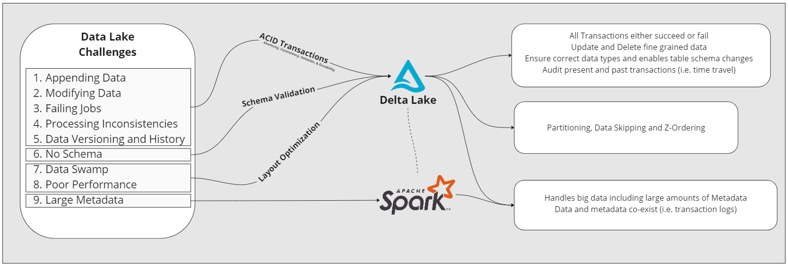
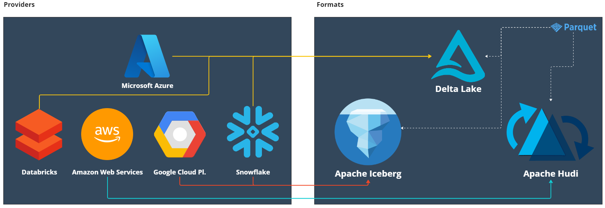

<!-- PROJECT SHIELDS -->
<!--
*** I'm using markdown "reference style" links for readability.
*** Reference links are enclosed in brackets [ ] instead of parentheses ( ).
*** See the bottom of this document for the declaration of the reference variables
*** for contributors-url, forks-url, etc. This is an optional, concise syntax you may use.
*** https://www.markdownguide.org/basic-syntax/#reference-style-links
-->
[![Contributors][contributors-shield]][contributors-url]
[![Forks][forks-shield]][forks-url]
[![Stargazers][stars-shield]][stars-url]
[![Issues][issues-shield]][issues-url]
[![MIT License][license-shield]][license-url]
[![LinkedIn][linkedin-shield]][linkedin-url]

<!-- ABOUT THE PROJECT -->
# Creating a Modern Data Lakehouse with Azure Synapse
## Azure Resource Deployment

This Data Lakehouse architecture uses Azure Synapse Analytics, Azure Data Lake Storage Gen2 (ADLS) and an Apache Spark pool (Spark Version 3.3). 

These Azure resources are provisioned using Infrastructure as Code (IaC) with a Azure Resource Management (ARM) template.

Click the button below to start the deployment process in Azure using the ARM template.

[![Deploy To Azure][azure-schield]][azure-url]

This template deploys the following Azure resources:

- An Azure Synapse Workspace
  - (OPTIONAL) Allows All connections in by default (Firewall IP Addresses)
  - Allows Azure Services to access the workspace by default  
- Apache Spark Pool
  - [Spark version 3.3](https://learn.microsoft.com/en-us/azure/synapse-analytics/spark/apache-spark-33-runtime)
  - Auto-paused set to 15 minutes of idling
- Azure Data Lake Storage Gen2 account
  - Azure Synapse Workspace identity given Storage Blob Data Contributor to the Storage Account
    - A new File System inside the Storage Account to be used by Azure Synapse
- Grants the Workspace identity CONTROL to all SQL pools and SQL on-demand pool

(<a href="#readme-top">back to top</a>)

<!-- GETTING STARTED -->
## What is a Data Lakehouse?

A Data Lakehouse is a data management architecture that combines the key advantages of Data Lakes and Data Warehouses into one.

The Data Lakehouse is made up of a Data Lake, that stores the data in a direct-access optimized format called Delta Lake, and Serverless Pools, that allow for queries made directly on the Data Lake.

What makes the Data Lakehouse so special is that the Data Lake essentially acts as a Data Warehouse. The Serverless Pools, used to query the data, add an on-demand SQL layer on top of the Data Lake allowing for large-scale data and computational functions. For comparison, in traditional Data Warehouses, the data would first need to be imported and stored on disk, before being available for querying.

By additionally storing the data in the Delta Lake format, important functionalities, that were previously only available in Data Warehouses, now also become accessible on the Data Lake. These functionalities are listed in chapter **Delta Lake to the Rescue**.

The Data Lakehouse can be created using several cloud service providers such as: **Microsoft Azure, Databricks, Amazon Web Services, Google Cloud Platform and Snowflake**, to name a few.

In this tutorial, we will be using **Microsoft Azure**.

(<a href="#readme-top">back to top</a>)

## Data Lakehouse Architecture

The architecture setup will follow the workflow of the diagram below:

The Data Lakehouse in this tutorial will be built using **Azure Synapse Analytics, Azure Data Lake Storage Gen2 (ADLS) and an Apache Spark Pool (Spark Version 3.3)**.

**Note: As of Febuary 23, 2023, Spark Version 3.3 is the highest GA version in Azure Synapse Analytics. Always check the latest supported Azure Synapse runtime releases and adjust the version accordinly, to access the latest Apache Spark features.**

The Azure resources are provisioned using Infrastructure as Code (IaC) with a Azure Resource Management (ARM) template.

The data stored in the Azure Data Lake Storage will be organized using the medallion structure.

The medallion structure uses three layers that denote the quality of the data being stored. Each layer is a folder directory inside the Azure Data Lake Storage. The three layers are:

- Bronze (raw)
- Silver (transformed and enriched)
- Gold (aggregated)
 
The data is imported, transformed and moved from one layer to the next using Data Flows in Azure Synapse Pipelines. Data Flows allow for the development of data transformation logic without writing code. For those of you familiar with Data Flows in Azure Data Factory, these are essentially the same objects, but created directly in Azure Synapse Analytics.

**Note: The data transformation logic can also be created outside of Data Flows, directly in Synapse Notebooks using PySpark and / or Spark SQL.**

Once the Data Flow activities have been finalized, the data in the Data Lake can be queried directly from each medallion layer using a Serverless Pool.

**Note: There are two types of Serverless Pools: a Serverless SQL Pool, which is automatically provisioned when creating a Azure Synapse Analytics workspace, and a Serverless Spark Pool, which needs to be provisioned manually. Both Serverless Pools can query the data on the Data Lake, but only the Serverless Spark Pool can take advantage of the Delta Lake format features.**

To query the data, scripts are written in Synapse Notebooks using PySpark and / or Spark SQL. Both of these languages are Spark flavours of Python and SQL. Additionally, Lake Databases and traditional SQL database objects such as: schemas, external tables and views can be created in Azure Synapse Analytics using Synapse Notebooks.

**Note: Synapse Notebooks are very similar to Jupyter Notebooks. Apart from PySpark and Spark SQL. Synapse Notebook scripts can also be written in Scala, R and .NET.**

Finally, the transformed data, made available in the gold layer of the medallion structure, can be used to create Delta Tables in the Lake Database. These Delta Tables can be read and imported into Power BI using a Serverless SQL Endpoint.

**Note: There currently is no Serverless Spark Endpoint to connect to the Lake Database from Power BI. For the time being, only a Serverless SQL Endpoint is available, which unfortunately limits certain Spark based Delta features, such as time traveling. In the future, especially with the creation of Microsoft Fabric, this missing Endpoint will certainly become available.**

(<a href="#readme-top">back to top</a>)

## Delta Lake to the Rescue!

To allow for Data Warehouse-like capabilties directly on the Data Lake and to overcome the typical challenges that Data Lakes have, a special type of data format named Delta Lake comes into play.

Most people who work with cloud based data management systems have heard of the open-source file format called Apache Parquet (or simply, Parquet). This column-oriented data file format provides efficient data compression and enhanced performance.

The Delta Lake file format (or simply, Delta) is an open source file protocol developed by Databricks that extends Parquet with a file-based transaction log for version control. This in turn enables the Data Warehouse-like functionalities specific to the Delta Lake protocol. The most important of those are:

- ACID compliance
- Time traveling
- Audit history
- Schema enforcements
- DML operations
- Query optimizations

These features empower both business intelligence (BI) and machine learning (ML) capabilties directly on the data stored in the Data Lake.

(<a href="#readme-top">back to top</a>)

## Other Data Format Protocols

It should be noted that there are other Parquet based open-source protocols such as **Apache Hudi and Apache Iceberg**, that offer the same capabilties as Delta Lake.

In the case of Azure Synapse Analytics or Microsoft in general, the out-of-the-box Data Lakehouse format is Delta Lake. This is also the case with the new all-in-one analytics solution called Microsoft Fabric, which uses a Data Lakehouse at its core, namely **OneLake**.

With additional configurations Apache Hudi or Apache Iceberg may also be used in Azure Synapse Analytics. However, these configuration steps are outside the scope of this workshop.

**Note: With the introduction of Universal Format (UniForm), Delta Lake can be used not only with Delta Lake tables but also with Apache Hudi and Apache Iceberg tables, unifying data regardless of the storage format.**

(<a href="#readme-top">back to top</a>)

<!-- FILES -->
## Documentation, Data & Support Files

The complete workshop, with all the necessary files can be found [here][Creating-a-modern-data-lakehouse-zip]. Download and unzip the file on your local computer.

The same files in the zip folder above can also be found individually directly in this repository (see links below).

**Workshop Tutorial**

- [Creating a Modern Data Lakehouse with Azure Synapse][Creating-a-modern-data-lakehouse-pdf]

**Data**

- [FactProductCategoryPredictions][FactProductCategoryPredictions-csv]
- [FactProductSales][FactProductSales-csv]

**Data Changes**

- [FactProductSales](data/changes/FactProductSales.csv)

**Azure Synapse Pipeline**

- [Dataflow](support/pipeline/TransformDeltaFormat.zip)

**Azure Synapse Notebooks**

- [Setup Bronze Database](support/notebooks/Setup-Bronze-Database.sql)
- [Setup Silver Database](support/notebooks/Setup-Silver-Database.sql)
- [Setup Gold Database](support/notebooks/Setup-Gold-Database.sql)

(<a href="#readme-top">back to top</a>)

<!-- CONTACT -->
## Contact

If there are any questions, feel free to reach out!

Nicolas Rehder - nrehder@allgeier.ch

(<a href="#readme-top">back to top</a>)

<!-- REFERENCES -->
## References

The following documentation was used to source the information contained in this workshop.

* [Azure Architectures](https://learn.microsoft.com/en-us/azure/architecture/browse/)
* [Medallion Structure](https://learn.microsoft.com/en-us/azure/databricks/lakehouse/medallion)
* [Medallion Structure Best Practices](https://piethein.medium.com/medallion-architecture-best-practices-for-managing-bronze-silver-and-gold-486de7c90055)
* [Azure Pipelines](https://aarfahrayees.medium.com/delta-lake-26e76469322c)
* [Data Lakehouse Strategy](https://techcommunity.microsoft.com/t5/azure-synapse-analytics-blog/building-the-lakehouse-implementing-a-data-lake-strategy-with/ba-p/3612291)
* [SQL Database & Lake Database](https://learn.microsoft.com/en-us/answers/questions/784144/what-is-the-difference-between-sql-database-and-la)

(<a href="#readme-top">back to top</a>)

<!-- MARKDOWN LINKS & IMAGES -->
<!-- https://www.markdownguide.org/basic-syntax/#reference-style-links -->
[contributors-shield]: https://img.shields.io/github/contributors/AllgeierSchweiz/azure-data-lakehouse.svg?style=for-the-badge
[contributors-url]: https://github.com/AllgeierSchweiz/azure-data-lakehouse/graphs/contributors
[forks-shield]: https://img.shields.io/github/forks/AllgeierSchweiz/azure-data-lakehouse.svg?style=for-the-badge
[forks-url]: https://github.com/AllgeierSchweiz/azure-data-lakehouse/network/members
[stars-shield]: https://img.shields.io/github/stars/AllgeierSchweiz/azure-data-lakehouse.svg?style=for-the-badge
[stars-url]: https://github.com/AllgeierSchweiz/azure-data-lakehouse/stargazers
[issues-shield]: https://img.shields.io/github/issues/AllgeierSchweiz/azure-data-lakehouse.svg?style=for-the-badge
[issues-url]: https://github.com/AllgeierSchweiz/azure-data-lakehouse/issues
[license-shield]: https://img.shields.io/github/license/AllgeierSchweiz/azure-data-lakehouse.svg?style=for-the-badge
[license-url]: https://github.com/AllgeierSchweiz/azure-data-lakehouse/blob/master/LICENSE.txt
[linkedin-shield]: https://img.shields.io/badge/-LinkedIn-black.svg?style=for-the-badge&logo=linkedin&colorB=555
[linkedin-url]: https://www.linkedin.com/in/nicolas-a-rehder/
[azure-schield]: https://raw.githubusercontent.com/Azure/azure-quickstart-templates/master/1-CONTRIBUTION-GUIDE/images/deploytoazure.svg?sanitize=true
[azure-url]: https://portal.azure.com/#create/Microsoft.Template/uri/https%3A%2F%2Fraw.githubusercontent.com%2FAllgeierSchweiz%2Fazure-data-lakehouse-lab%2Fmain%2Fazuredeploy.json
[product-screenshot]: images/screenshot.png
[Next.js]: https://img.shields.io/badge/next.js-000000?style=for-the-badge&logo=nextdotjs&logoColor=white
[Next-url]: https://nextjs.org/
[React.js]: https://img.shields.io/badge/React-20232A?style=for-the-badge&logo=react&logoColor=61DAFB
[React-url]: https://reactjs.org/
[Vue.js]: https://img.shields.io/badge/Vue.js-35495E?style=for-the-badge&logo=vuedotjs&logoColor=4FC08D
[Vue-url]: https://vuejs.org/
[Angular.io]: https://img.shields.io/badge/Angular-DD0031?style=for-the-badge&logo=angular&logoColor=white
[Angular-url]: https://angular.io/
[Svelte.dev]: https://img.shields.io/badge/Svelte-4A4A55?style=for-the-badge&logo=svelte&logoColor=FF3E00
[Svelte-url]: https://svelte.dev/
[Laravel.com]: https://img.shields.io/badge/Laravel-FF2D20?style=for-the-badge&logo=laravel&logoColor=white
[Laravel-url]: https://laravel.com
[Bootstrap.com]: https://img.shields.io/badge/Bootstrap-563D7C?style=for-the-badge&logo=bootstrap&logoColor=white
[Bootstrap-url]: https://getbootstrap.com
[JQuery.com]: https://img.shields.io/badge/jQuery-0769AD?style=for-the-badge&logo=jquery&logoColor=white
[JQuery-url]: https://jquery.com 
[Creating-a-modern-data-lakehouse-zip]: https://downgit.github.io/#/home?url=https://github.com/AllgeierSchweiz/azure-data-lakehouse-lab/blob/main/Creating-a-Modern-Data-Lakehouse-with-Azure-Synapse.zip
[Creating-a-modern-data-lakehouse-pdf]: https://downgit.github.io/#/home?url=https://github.com/AllgeierSchweiz/azure-data-lakehouse-lab/blob/main/documentation/Creating-a-Modern-Data-Lakehouse-with-Azure-Synapse.pdf
[FactProductCategoryPredictions-csv]: https://downgit.github.io/#/home?url=https://github.com/AllgeierSchweiz/azure-data-lakehouse-lab/blob/main/data/FactProductCategoryPredictions.csv
[FactProductSales-csv]: https://downgit.github.io/#/home?url=https://github.com/AllgeierSchweiz/azure-data-lakehouse-lab/blob/main/data/FactProductSales.csv
